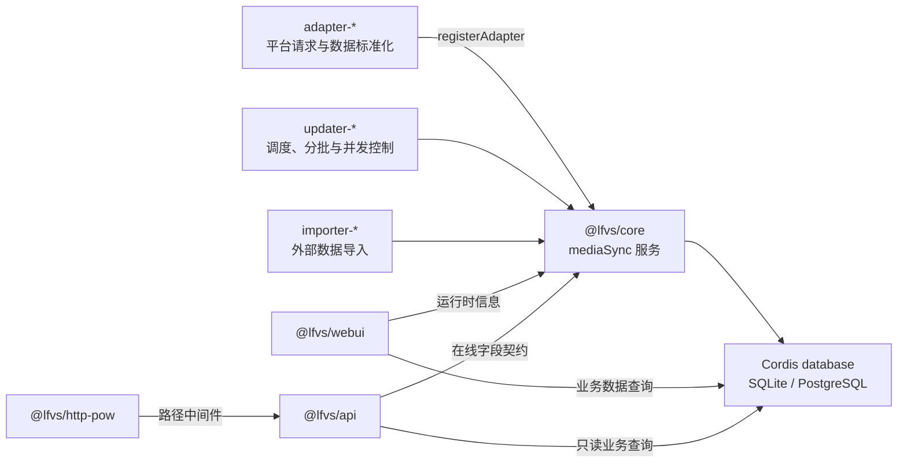
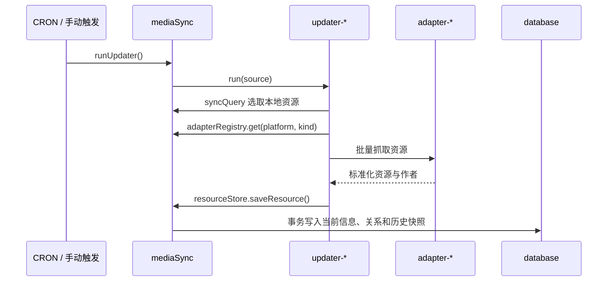

# LFVS-2

基于 Cordis 的多平台媒体资源同步系统，采用 workspace monorepo 结构。系统将平台访问、更新策略、数据写入和展示拆分为独立插件，并通过 `@lfvs/core` 提供的 `mediaSync` 服务衔接。

## 当前插件

- `@lfvs/core`：定义通用数据模型，管理适配器、更新器、扩展字段、同步查询、检查点和统一写入规则。
- `@lfvs/api`：对外提供按在线 updater 字段契约过滤的只读 REST API。
- `@lfvs/http-pow`：通过 server 前置中间件匹配配置路径，执行无状态 Challenge 校验和内存防重放保护。
- `@lfvs/adapter-bilibili-video`：通过 [bilibili-rs-gateway](https://github.com/Roberta001/bilibili-rs-gateway) 获取并标准化 Bilibili 视频详情。
- `@lfvs/updater-bilibili-video`：由 CRON 定期全量刷新本地 Bilibili 视频，默认 4 并发、每批 250 个 BVID。
- `@lfvs/importer-vocabili`：从 Vocabili 榜单导入本地缺失的视频，同时补充作者、资源关系和首次历史快照。
- `@lfvs/webui`：在 Cordis WebUI 中提供 LFVS 数据概览、检索和运行时管理页面。

## 系统架构



适配器不操作数据库，只把平台响应转换成 `NormalizedResource` 和 `NormalizedAuthor`。更新器负责何时执行、选取哪些资源以及如何分批调用适配器，最终将标准化结果交给 core 写入。core 统一维护当前资源、作者、作者关系、历史快照和同步检查点。WebUI 和 API 从 core 读取在线适配器、更新器和有效扩展字段等运行时信息，业务数据查询则直接使用 Cordis database 服务。

系统使用五张表：`authors`、`resources`、`resource_authors`、`resource_histories` 和 `checkpoints`。其中当前信息与历史快照分开存储，资源和作者通过关系表关联。

## Core 接口

core 插件向 Cordis 上下文注册 `mediaSync` 服务。依赖它的插件应使用：

```ts
export const inject = ['mediaSync']
```

`ctx.mediaSync` 提供以下主要接口。

### 适配器注册

- `registerAdapter(adapter)`：注册一个 `platform + kind` 适配器，返回卸载函数。同一目标只允许一个在线适配器。
- `adapterRegistry.get(platform, kind)`：获取当前在线适配器。
- `adapterRegistry.list()`：获取在线适配器实例。
- `adapterRegistry.describe()`：获取在线适配器及其能力声明，供运行时界面或 API 使用。

适配器至少实现 `getResource()` 和 `getAuthor()`，可通过 `capabilities` 声明批量资源、批量作者和作者资源列表能力。能力声明必须与实际实现的方法一致。

```ts
ctx.effect(() => ctx.mediaSync.registerAdapter({
  platform: 'example',
  kind: 'video',
  capabilities: {
    resourceBatch: { supported: true, maxBatchSize: 100 },
  },
  getResource,
  getResources,
  getAuthor,
}))
```

### 更新器与扩展字段

- `registerUpdater(definition)`：注册更新器的标识、目标、CRON 信息、手动触发能力和执行函数。
- `runUpdater(id, source)`：以 `schedule`、`manual` 或 `startup` 来源运行更新器；core 会阻止同一更新器重入，并记录最近运行结果和错误。
- `updaterRegistry.list()` / `get(id)`：读取当前在线更新器及其内存运行状态。
- `registerUpdaterFields(registration)`：由更新器声明 `authors`、`resources` 或 `resourceHistories` 的扩展字段，并执行加法式数据库扩展。
- `listUpdaterFieldExtensions(filter)`：列出当前在线更新器申请的字段。
- `resolveUpdaterFields(platform, kind)`：合并指定目标当前有效的扩展字段，供 API 确定响应结构。

扩展字段的所有权属于更新器。更新器卸载后，数据库中已经创建的列不会删除，但这些字段会从在线字段声明中消失，表示它们当前不再被维护。

更新器通常按以下顺序接入：

```ts
await ctx.effect(() => ctx.mediaSync.registerUpdaterFields({
  owner: 'example-video-updater',
  platform: 'example',
  kind: 'video',
  fields: {
    resources: { exampleMediaId: { type: 'string', nullable: true } },
    resourceHistories: { exampleMetric: { type: 'bigint', nullable: true } },
  },
}))

ctx.effect(() => ctx.mediaSync.registerUpdater({
  id: 'example-video-updater',
  platform: 'example',
  kind: 'video',
  cron: '0 * * * *',
  manualTrigger: true,
  run: async () => {
    // 查询本地目标、调用适配器并通过 resourceStore 写入。
  },
}))
```

### 查询、写入与检查点

- `syncQuery.listResourcesForSync()`：按 `lastSyncedAt` 选取待更新资源。
- `syncQuery.listAuthorsForSync()`：按 `lastSyncedAt` 选取待更新作者。
- `syncQuery.listExistingResourceIds()`：批量检查业务 ID 是否已经存在，供导入器过滤重复资源。
- `resourceStore.saveAuthor()`：按 `platform + id` 新增或更新作者。
- `resourceStore.saveResource()`：按 `platform + kind + id` 写入资源、作者关系和历史快照。
- `resourceStore.saveResourceWithAuthors()`：在同一事务内写入作者、资源、关系和历史快照。
- `checkpointStore.get()` / `set()` / `remove()`：保存更新器的分页游标、页码、时间水位或自定义状态。

`ResourceStore` 会过滤未声明的扩展字段，并保证旧抓取结果不会覆盖更新的当前信息。字段值为 `undefined` 时保留数据库原值，显式 `null` 才会清空字段；历史记录按资源和采集时间去重。

## 典型更新流程



适配器负责“如何从平台获取数据”，更新器负责“何时、更新哪些数据”，core 负责“数据如何安全地进入统一模型”。这种边界允许新的平台适配器和更新策略独立增加，而不需要复制数据库写入规则。

## 开发

```powershell
Copy-Item app.yml.example app.yml
npm install
npm run dev
```

默认服务地址为 `http://127.0.0.1:3140`。运行前请在 `app.yml` 中确认 Bilibili gateway 的 `endpoint` 配置。

只读 API 默认位于 `http://127.0.0.1:3140/api/v1`，OpenAPI 文档位于 `/api/v1/openapi.json`。

`@lfvs/http-pow` 通过 `ctx.server.use()` 在进入路由前匹配 `lightPaths`、`normalPaths` 和 `bulkPaths`，不需要 API 插件注入该服务。首次请求受保护路径会返回 `428` 和 challenge；客户端找到使 `SHA-256(challenge + "." + lowercaseHexNonce)` 满足前导零位数的 nonce 后，将 challenge 和 nonce 分别放入 `X-LFVS-PoW-Challenge`、`X-LFVS-PoW-Nonce` 重试。默认难度为 `18 / 20 / 22`，分别对应轻量、常规和全量接口；全量接口额外限制为单并发和每客户端 5 分钟冷却。生产环境可按真实客户端的求解速度调整。

所有插件位于 `external/*`，依赖统一安装在 monorepo 根目录的 `node_modules` 中。完整数据模型和设计约束参见 [`docs/media-sync-architecture.md`](docs/media-sync-architecture.md)。
